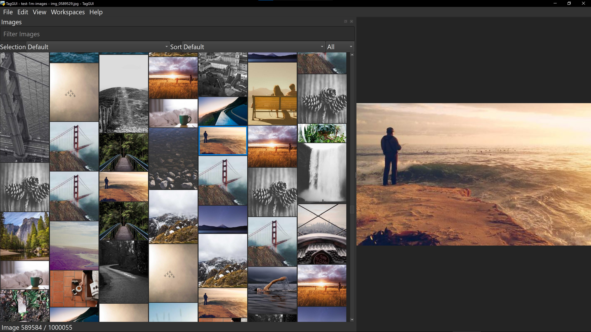

# TagGUI Video 1M v1.0.0

  

  

TagGUI Video 1M is a desktop tool for browsing, tagging, and reviewing very large image and video collections.

It is built to help you see your media clearly, whether you are reviewing AI generations, sorting downloaded folders, or browsing large personal archives. The masonry layout makes large collections easy to scan, compare, filter, caption, tag, and clean up.

It grew from the original TagGUI, which was focused on preparing captioned and tagged datasets for image-model training, into a broader media workflow app with video support, floating viewers, image comparison, skins, and 1M-scale dataset work.

Captioning and tagging remain core to the project, including workflows that support training preparation for both image and video models.

## Start Here

- [Documentation Hub](docs/HUB.md)

## Quick Links

- [Install and Launch](docs/GETTING_STARTED.md)
- [Video Workflow](docs/VIDEO_WORKFLOW_GUIDE.md)
- [Floating Viewers and Compare Mode](docs/FLOATING_VIEWERS_USER_GUIDE.md)
- [Skins and Skin Designer](docs/SKIN_DESIGNER_GUIDE.md)
