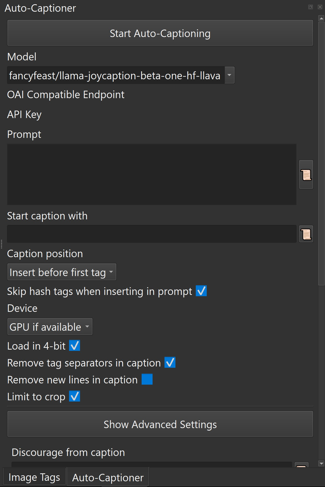

# Captioning Guide

[Back to Documentation Hub](HUB.md)

Captioning and tagging remain core workflows in TagGUI Video 1M.

The project started from dataset-preparation use cases, and that is still reflected in the current app: you can browse large collections, then filter, caption, and tag them for organization, cleanup, and training preparation.

> [!NOTE]
> Additional generation-parameter background is available in the [Hugging Face `GenerationConfig` documentation](https://huggingface.co/docs/transformers/main/en/main_classes/text_generation#transformers.GenerationConfig).

## What the Auto-Captioner Does

The Auto-Captioner can generate captions or tags for selected files inside TagGUI.

Current code indicates support for:

- manual prompt-driven captioning
- batch caption generation for multiple selected files
- local model discovery
- WD tagger-style tag generation
- prompt history
- crop-limited captioning

GPU use requires compatible hardware and model support, but CPU generation is also supported for some workflows.

> [!NOTE]
> Video captioning behavior depends on the selected model. Standard models (like Florence-2 or LLaVA) are frame-based and caption a single representative still frame per video (preferring the saved loop-start marker). However, video-native models (like Qwen-VL) process the entire video timeline continuously, extracting multiple frames based on your Advanced Settings (`Video FPS` and `Max video frames`) to build a comprehensive temporal understanding of the clip.

## Basic Workflow

1. Select one or more files in the image list.
2. Open the `Auto-Captioner` pane.
3. Choose a captioning model.
4. Configure the prompt and generation settings.
5. Click `Start Auto-Captioning`.

<p align="center">
  
</p>

The app also supports loading previously downloaded local models through the models directory setting in `File -> Settings`.

## Main Fields

The current UI exposes these main captioning controls.

### System Prompt

The system prompt defines behavioral constraints and deep-level instructions, distinct from the standard prompt.

- It is heavily utilized by modern reasoning models (e.g., Qwen3.5-VL) to direct their internal chain-of-thought analysis.
- It is highly recommended to encourage "private reasoning" in the system prompt for reasoning models, allowing them to think thoroughly and output a highly polished final description.

### Prompt

The prompt gives instructions to the captioning model.

Prompt formats are handled automatically based on the selected model.

Template variables currently documented for the workflow:

- `{tags}`: current tags, separated by commas
- `{name}`: file name without extension
- `{directory}` or `{folder}`: containing folder name

Example:

```text
Describe the image using the following tags as context: {tags}
```

### Start Caption With

Prepends a fixed starting string to generated captions.

This is useful when you want a consistent phrasing style across a dataset.

Note: some models may not support this field equally. The code explicitly shows at least one Florence-2 path warning that `Start caption with` is not supported there.

### Remove Tag Separators in Caption

When enabled, separators such as commas are removed from the generated caption text.

This is useful when you want more natural sentence-like output instead of tag-list formatting.

### Discourage from Caption

This field lets you provide words or phrases that the model should avoid.

- separate entries with commas
- useful for discouraging uncertain wording like `appears`, `seems`, or `possibly`

As with most generation constraints, this is guidance rather than a hard guarantee.

### Include in Caption

This field lets you provide words or phrases that should appear somewhere in the result.

- separate required entries with commas
- use `|` inside one entry to give the model a choice group

Example:

```text
cat,orange|white|black
```

That means the result should include `cat` and one of `orange`, `white`, or `black`.

### Tags to Exclude

This field is especially relevant for WD tagger-style models.

Use it to suppress specific tags from the generated output.

### Limit to Crop

The current Auto-Captioner UI includes `Limit to crop`.

This is important when you want captioning to follow the currently defined crop rather than the full image.

That makes it especially relevant for training-preparation workflows where crop and caption should describe the same visible subject area.

> [!TIP]
> `Limit to crop` is especially useful when you want the generated caption to match the exported or training-visible region instead of the entire source image or frame.

## Local Models

The settings dialog includes an `Auto-captioning models directory`.

This allows TagGUI to discover compatible local models without requiring every model to be downloaded on first use through the main flow.

Common local-model files include:

- `config.json`
- WD tagger support files such as `selected_tags.csv`

## Model Coverage

TagGUI includes a broad set of captioning backends, including examples like:

- CogVLM
- CogVLM2
- Florence-2
- Florence-2 PromptGen
- JoyCaption
- Kosmos-2
- LLaVA variants
- Moondream
- Phi-3 Vision
- Qwen-VL (Qwen2.5-VL, Qwen3.5-VL natively supporting temporal video)
- WD Tagger
- remote generation path

Exact behavior and supported prompt controls vary by model.

## Practical Use Cases

Captioning in TagGUI Video 1M is useful for:

- preparing captioned datasets for image-model training
- cleaning and normalizing existing text metadata
- generating first-pass tags before manual review
- captioning cropped subjects instead of whole images
- supporting image and video model preparation workflows

## Notes

- Caption generation may take time on first use, especially when models need to be loaded or downloaded.
- Prompt quality still matters. Auto-captioning works best when followed by human review for important datasets.
- Different models expose different strengths: some are better at descriptive captions, others are better at tag-style outputs.
- A future model-specific reference page may be useful if you want to document recommended models for different tasks.

## Video Walkthrough

- [Old TagGUI video workflow walkthrough](https://youtu.be/FGNSq01nOT4)
- Still useful for the older captioning workflow and core auto-captioner concepts
- It predates some newer UI additions such as the current skin system
