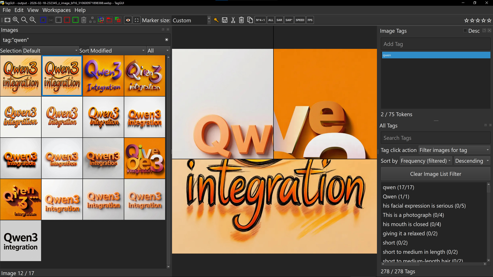

# Compare Guide

[Back to Documentation Hub](HUB.md)

TagGUI Video 1M supports comparison for both images and videos.

The compare workflow is built around drag-and-hold merging: drag one media item onto a target viewer, hold briefly, then release to enter compare mode.

  

## Basic Compare Gesture

To start a compare:

1. Pick a source image or video.
2. Drag it onto a target viewer.
3. Hold for about 1 second until the target feedback is ready.
4. Release to create the compare.

You can start the drag from:

- the image list or masonry view
- a floating viewer window

Compare works with the main viewer and floating viewers as targets.

## What Compare Supports

- image-to-image compare
- video-to-video compare
- multi-image compare
- multi-video compare

Mixed media pairs such as `image + video` are rejected.

## Image Compare

Image compare opens directly inside the target viewer.

This is useful when you want to:

- compare two similar generations
- inspect edits or variations
- review subtle differences quickly

Important behavior:

- the target viewer keeps the left/base side
- the dragged item becomes the right/overlay side
- the divider follows the cursor while compare mode is active
- press `Esc` to exit
- if compare is already active, dropping another source onto the same target expands the compare before it starts replacing the right-side layer

Image compare can also expand beyond two items for broader visual comparison.

  

## Video Compare

Video compare opens a dedicated compare window instead of reusing the normal in-viewer image compare path.

This is useful when you want to:

- compare timing between clips
- compare motion or edits side by side
- inspect two or more similar video outputs

Supported workflows include:

- 2-video compare
- 3-video compare
- 4-video compare

Video compare automatically runs sync logic for the compared videos when the compare window opens.

## Compare from Floating Viewers

Floating viewers are especially useful for compare workflows.

You can:

- spawn multiple viewers
- load different images or videos into them
- drag one floating viewer onto another target viewer
- hold and release to merge them into compare mode

If the source is a floating viewer, it closes after a successful merge into the target.

## Fit Modes

Compare supports different fit modes so you can decide how the compared media should fill the view.

Available modes:

- `Preserve Aspect Ratio`
- `Fill (Crop)`
- `Stretch (Distorts)`

These are useful when you need either:

- faithful framing
- maximum screen usage
- forced alignment for visual inspection

## Sync and Timing Notes

For video work, compare and sync are closely related.

- right-clicking a floating viewer gives access to `Sync video`
- sync is useful for practical visual comparison
- compare is meant for inspection and workflow use, not for claiming perfect frame-locked playback across all cases

## Exit and Replace

To leave compare mode:

- press `Esc`
- use `Exit compare mode` from the viewer context menu when available

To update an existing compare:

- drag another source onto the same compare target
- hold again
- release to add another compare layer when space is available
- once the compare is already full, the new source replaces the right-side layer

## When to Use Compare

Compare is especially useful for:

- selecting the best AI generation
- checking edits before deleting duplicates
- comparing video timing or motion
- reviewing alternate crops or exports
- checking differences before tagging or captioning

## Related Docs

- [Floating Viewers User Guide](FLOATING_VIEWERS_USER_GUIDE.md)
- [Video Workflow Guide](VIDEO_WORKFLOW_GUIDE.md)
- [Shortcuts](SHORTCUTS.md)
