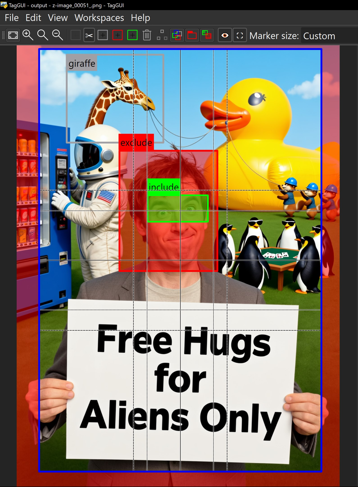
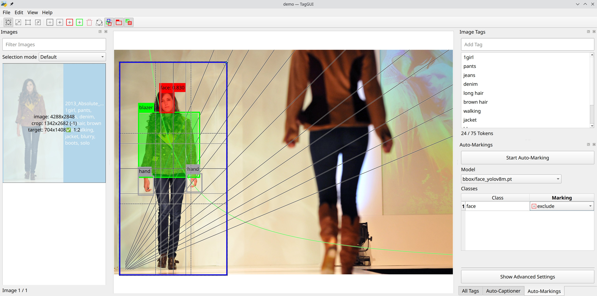

# Markings Guide

[Back to Documentation Hub](HUB.md)

Markings are the visual annotation system in TagGUI Video 1M.

> [!NOTE]
> The markings workflow comes from the upstream fork lineage this project builds on, especially the `StableLlama/taggui` fork, rather than the original TagGUI baseline. It remains an important part of TagGUI Video 1M.

They let you do more than text tagging: you can define crop areas, mark regions as hints, and build include or exclude masks for export and training workflows.

  

## Marking Types

TagGUI currently uses four main marking types:

- `Crop`: defines the area that will be exported
- `Hint`: visual annotation only, useful for labeling and filtering
- `Exclude`: area that should be masked out during export
- `Include`: area that should be kept during export

Except for `Crop`, marking types can be changed into each other.

## Crop

The crop is the main export boundary.

- It is shown with a blue border.
- It defines which part of the image is kept for export.
- If export settings require bucket fitting, TagGUI may need to crop further than the visible crop box.
- That extra trimmed area is shown as a semi-transparent red overlay.

  

Crop editing also shows visual guidance:

- size information in the image list overlay
- crop size and target size hints
- aspect-ratio hints when the crop matches a known ratio
- composition guides inside the crop area
- crop-fit guidance for export resolution and bucket settings

While editing a crop:

- `Alt` temporarily hides crop guide lines
- `Shift` while dragging snaps the crop to the next position that fits current export settings
- `Shift` + `Ctrl` drag is referenced in settings as exact bucket snapping for crop work

## Hint

A hint is a neutral visual annotation.

- It is shown with a gray border.
- It does not directly affect export output.
- It can be labeled and used for filtering.
- It can later be changed into an include or exclude marking.

Hints are useful when you want to tag visual structure without committing to masking behavior.

## Exclude

An exclude marking defines an area that should be removed from the exported result.

- It is shown with a red border.
- It is used as a mask-out region during export.
- When latent-space and alpha quantization settings are active, the masked region may expand slightly to preserve the exclusion reliably.

Exclude is useful for hiding unwanted regions, background elements, faces, or anything else that should not remain in the training output.

## Include

An include marking defines an area that should remain in the exported result.

- It is shown with a green border.
- If no include markings exist, the full image remains included, subject to crop.
- If include and exclude overlap, exclude takes precedence.
- When latent-space and alpha quantization settings are active, include regions may shrink slightly to stay aligned with the export mask grid.

Include is useful when you want to constrain training output to a specific subject or region.

## Working with Markings

You can create markings from the toolbar or with drag gestures.

Current marking toolbar actions include:

- Add crop
- Add hint
- Add exclude mask
- Add include mask
- Delete marking
- Change marking type
- Show markings
- Show labels
- Show marking in latent space
- Apply crop to file

Useful interaction behavior:

- Hold `Ctrl` while creating a marking to create a hint
- Hold `Ctrl` + `Alt` while creating a marking to create an exclude
- Drag a marking to move it
- Drag edges or corners to resize it
- Click the label to edit the marking text
- Right-click a marking to change its type

The crop can also be applied directly to the source file through the crop-apply action. This is destructive, though the code indicates it creates a backup.

## Labels and Filtering

Non-crop markings can carry a label.

That label can be used to:

- identify the marked region
- organize annotation work
- filter images by marking name
- combine visual annotation with text-based search/filter workflows

The existing filter system also supports marking-aware queries such as:

- `marking:label`
- confidence comparisons on marking labels
- visibility/crop-related marking filters

These filtering details should later move into a dedicated filtering guide.

## Auto-Marking with YOLO

TagGUI also supports automatic marking detection with YOLO models.

To use it:

- configure the auto-marking models directory in `Settings`
- select a YOLO model in the auto-marking UI
- choose what each detected class should become:
  - ignore
  - hint
  - exclude
  - include

The UI and code indicate support for:

- confidence thresholds
- IoU tuning
- maximum detections per image
- per-class mapping into TagGUI marking types

This is useful when you already have YOLO or ADetailer-style detection models and want to accelerate masking or annotation work.

## Display Toggles

The marking system includes display toggles for:

- showing or hiding markings
- showing or hiding labels
- showing marking areas in latent space

These are useful when you want to inspect the image cleanly or verify how masks align to training/export constraints.

## Notes

- Crop guidance and latent-space overlays are especially relevant for export and training preparation workflows.
- Markings remain part of TagGUI Video 1M and connect directly to filtering, export, and dataset preparation.
- [Export Guide](EXPORT_GUIDE.md) explains how include/exclude markings interact with export settings and output behavior.

> [!WARNING]
> Tags and star ratings have DB-backed support, but markings are still stored in sidecar JSON metadata. The paginated SQL filter path does not yet implement marking-based predicates such as `marking:`, `crops:`, or `visible:`.

## Continue Reading

- [Export Guide](EXPORT_GUIDE.md)
- [Filtering Guide](FILTERING_GUIDE.md)
- [Captioning Guide](CAPTIONING_GUIDE.md)
