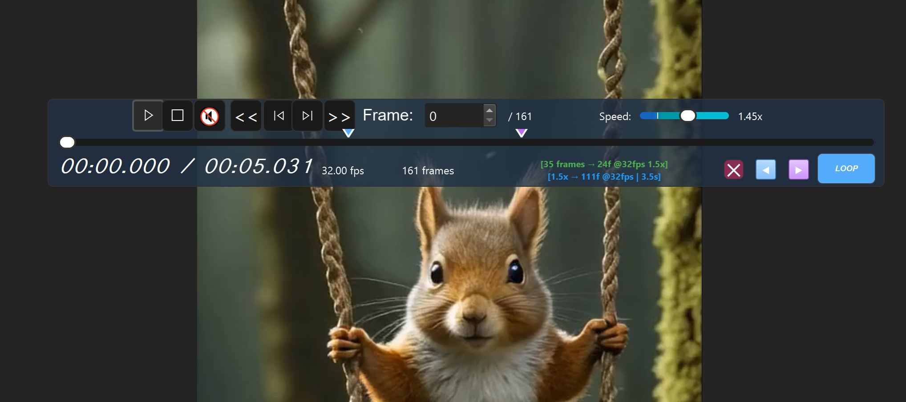
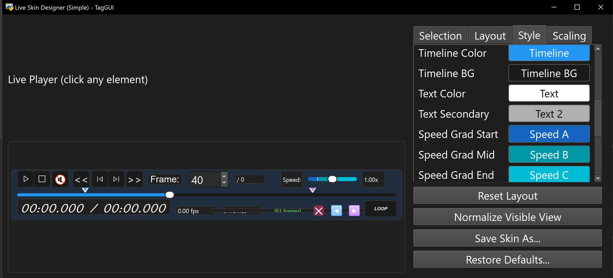

# Skin Designer Guide

[Back to Documentation Hub](HUB.md)

TagGUI Video 1M includes a skinnable video player.

You can use built-in skins, switch between them instantly, and create your own custom skins with the visual designer.

## Start with Built-In Skins

The simplest workflow is:

1. Click a video in the media list.
2. Open the video controls.
3. Change the skin.

You can change skins from:

- `Settings -> Video player skin`
- the video controls right-click menu

Skin changes apply immediately. No restart is required.

  

## Custom Skin Design

If the built-in skins are not enough, you can open the custom skin designer from the video controls.

The designer is meant for:

- changing the look of the controls
- adjusting layout and spacing
- testing a custom visual style on the real player

> [!NOTE]
> The skin system works, and the custom designer works, but the designer can still have rough edges. If you find a reproducible issue, it should be reported as a bug.

  

## What Skins Affect

Skins can change the look and layout of the video controls, including:

- control bar appearance
- button colors and spacing
- timeline appearance
- loop marker appearance
- speed slider appearance
- text styling
- layout proportions

This lets you treat the video player as both a functional tool and a customizable workspace.

## Control Visibility and Resizing

The video controls are not fixed to one rigid layout.

Important behavior:

- the control bar can auto-hide or stay visible
- the control bar can be resized
- when the available width gets smaller, the controls simplify automatically
- at larger sizes, more controls are shown
- at smaller sizes, lower-priority controls are hidden to keep the main playback actions usable

This means the player can adapt from a fuller editing-oriented control bar down to a more compact playback-oriented one.

## Compact Control Modes

When the controls become small enough, TagGUI reduces visual complexity automatically.

That includes behavior such as:

- hiding less important labels
- hiding some secondary controls
- keeping core playback actions available
- eventually reducing the visible controls to the most important actions

This is especially useful when:

- the viewer is small
- you are working with spawned viewers
- you want a cleaner, less crowded control area

## Reset and Recovery

If a custom skin or layout feels wrong, you do not need to stay stuck with it.

TagGUI includes reset and restore flows so you can get back to a safer state and continue working.

If something looks broken:

- switch back to a built-in skin
- try the reset or restore options in the designer
- if the issue is reproducible, report it

## Who This Is For

The skin system is useful for different kinds of users:

- users who just want to choose a built-in look
- users who want a more comfortable control layout
- users who want a custom visual identity for the player
- users who work a lot with video and want the controls to better match their workflow

## Technical References

If you want to go deeper, these references already exist:

- [Skin README](../taggui/skins/README.md)
- [Skin Property Reference](../taggui/skins/PROPERTY_REFERENCE.md)
