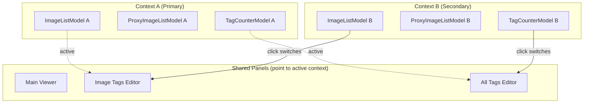

# Secondary Image Browser with Context Switching

## Problem

TagGUI has a single image list panel. When using it for visualization, the user needs to browse two folders simultaneously. Clicking an image from either panel should load it in the viewer AND switch the tag/all-tags panels to show that folder's context.

## Approach: Independent Secondary Browser + Lightweight Context Switch

The secondary browser is a **complete, independent dock widget** with its own model stack. When the user clicks in it, a lightweight context switch **swaps which models the right-side panels point to**. No data recomputation — the secondary's models are already loaded.



## What Happens on Context Switch

When user clicks an image in the **secondary** browser:

| Component | Action | Complexity |
|-----------|--------|-----------|
| Main Viewer | Load the clicked image by path | Trivial — one call |
| Image Tags Editor | Swap `proxy_image_list_model` ref → secondary's proxy, call `load_image_tags()` | ~10 lines |
| All Tags Editor | Swap tag counter model on the list view: `setModel(secondary.tag_counter_model)` | ~5 lines |
| Tag writing signals | Disconnect `add_tags`, `rename_tags`, `delete_tags` from primary model, reconnect to secondary model | ~30 lines |
| Visual indicator | Change dock title bar color to indicate active context | ~10 lines |
| Auto-captioner | **Gray out** — stays primary-only for now | Simple disable |

When user clicks back on the **primary** image list — reverse the swap. Everything restores instantly.

**Total switching logic: ~80-120 lines of code.**

## Proposed Changes

---

### Core: Secondary Browser

#### [NEW] `taggui/widgets/secondary_browser.py` (~300-400 lines)

A self-contained `QDockWidget` with its own complete model stack:

```python
class SecondaryBrowser(QDockWidget):
    """Independent folder browser — a second TagGUI instance in the same window."""
    
    # Emitted when user clicks an image — carries the proxy index and model refs
    context_activated = Signal(object)  # Emits a context dict
    
    def __init__(self, image_width, tag_separator):
        # Own ImageListModel
        self.image_list_model = ImageListModel(image_width, tag_separator)
        # Own ProxyImageListModel
        self.proxy_image_list_model = ProxyImageListModel(
            self.image_list_model, tokenizer, tag_separator)
        # Own TagCounterModel
        self.tag_counter_model = TagCounterModel()
        # Own ImageListView (masonry, thumbnails, etc.)
        self.list_view = ImageListView(...)
        # Own filter, sort, media type, status bar
        # ...
```

Contains:
- "Open Folder" button in header
- Full filter bar, sort combo, media type tabs
- Full masonry `ImageListView`
- Thumbnail size controls (+/- buttons)
- Image index label
- Its own selection model

#### [NEW] `taggui/widgets/context_switch_manager.py` (~120 lines)

Manages the context switching logic — clean separation from MainWindow:

```python
class ContextSwitchManager:
    """Handles switching active context between primary and secondary browsers."""
    
    def __init__(self, main_window):
        self.main_window = main_window
        self._active_context = 'primary'
        self._connected_model = None  # Track which model signals are connected to
    
    def switch_to_context(self, context: dict):
        """Swap right-side panels to point to the given context's models."""
        old_model = self._connected_model
        new_model = context['image_list_model']
        new_proxy = context['proxy_image_list_model']
        new_tag_counter = context['tag_counter_model']
        new_proxy_index = context['current_proxy_index']
        
        # 1. Disconnect tag-writing signals from old model
        self._disconnect_tag_signals(old_model)
        
        # 2. Swap proxy model on ImageTagsEditor
        self.main_window.image_tags_editor.proxy_image_list_model = new_proxy
        
        # 3. Load tags for clicked image
        self.main_window.image_tags_editor.load_image_tags(new_proxy_index)
        
        # 4. Swap tag counter model on AllTagsEditor
        self.main_window.all_tags_editor.all_tags_list.setModel(new_tag_counter)
        
        # 5. Reconnect tag-writing signals to new model
        self._connect_tag_signals(new_model)
        
        # 6. Update visual indicators
        self._update_active_indicators(context['name'])
        
        self._connected_model = new_model
        self._active_context = context['name']
```

---

### Modifications to Existing Files

#### [MODIFY] [main_window.py](file:///home/linux/taggui/taggui/taggui/widgets/main_window.py)

Minimal additions:
- `self._secondary_browser: SecondaryBrowser | None = None`
- `self._context_switch_manager = ContextSwitchManager(self)`
- `open_secondary_browser()` — creates dock on demand, opens folder picker
- `close_secondary_browser()` — cleans up and restores primary context
- Connect secondary browser's `context_activated` signal
- Connect primary image list's selection to restore primary context
- Add `load_image_from_path(path)` method or verify existing path-based loading

#### [MODIFY] [menu_manager.py](file:///home/linux/taggui/taggui/taggui/controllers/menu_manager.py)

- Add "Open Secondary Browser" action to the View menu (or File menu)
- Add keyboard shortcut (e.g., `Ctrl+Shift+B`)

#### [MODIFY] [image_viewer.py](file:///home/linux/taggui/taggui/taggui/widgets/image_viewer.py)

- Add/verify `load_image_from_path(path: Path)` method
- This loads an image/video by file path without requiring a QModelIndex from a specific model

#### [MODIFY] [image_tags_editor.py](file:///home/linux/taggui/taggui/taggui/widgets/image_tags_editor.py)

- Make `proxy_image_list_model` swappable (it's already just an attribute — just need to accept being reassigned)
- No structural changes needed — `load_image_tags()` already does all the work

#### [MODIFY] [all_tags_editor.py](file:///home/linux/taggui/taggui/taggui/widgets/all_tags_editor.py)

- `all_tags_list.setModel()` already works for swapping the QAbstractListModel
- May need to refresh the view after swap

---

### Visual Context Indicator

When the secondary context is active:
- Secondary browser dock title bar gets a **colored accent** (e.g., a subtle blue tint or colored strip)
- Primary image list title bar is dimmed slightly
- Image Tags editor title shows "(Secondary)" suffix
- All Tags editor title shows "(Secondary)" suffix

When primary is active:
- Normal appearance for everything
- Secondary browser dock title bar is neutral

---

### Signals That Need Reconnecting on Context Switch

These are the tag-writing signals that need to be disconnected from the old model and reconnected to the new model:

```python
# From connect_image_tags_editor_signals():
image_tags_editor.tag_input_box.tags_addition_requested → image_list_model.add_tags

# From connect_all_tags_editor_signals():
tag_counter_model.tags_renaming_requested → image_list_model.rename_tags
all_tags_list.tags_deletion_requested → image_list_model.delete_tags
all_tags_list.tag_addition_requested → main_window.add_tag_to_selected_images
```

The ContextSwitchManager handles disconnect/reconnect for these ~4-5 signal pairs. The read-only display signals (modelReset, dataChanged → update counts) are handled per-model already and don't need swapping.

---

### Excluded from Context Switching (for now)

| Component | Why |
|-----------|-----|
| Auto-captioner | Operates on model + selection batch — complex to swap safely |
| Auto-markings | Same — model-dependent batch operations |
| Undo/redo | Each model already has its own undo stack; menu actions stay primary |
| Sort/filter restore | Each browser has its own independent sort/filter |

Auto-captioner stays grayed out when secondary is active. Could be added later.

---

## Open Questions

> [!IMPORTANT]
> 1. **Dock position**: Should the secondary browser default to the left side (tabified with primary image list) or somewhere else?
>
> 2. **Remember folder**: Persist the secondary browser's last-opened folder across restarts?
>
> 3. **Independent thumbnail size**: Own size control per browser, or shared?
>
> 4. **Shortcut**: `Ctrl+Shift+B` to toggle the secondary browser, or different?

## Verification Plan

### Manual Verification
1. Open primary folder → verify normal behavior 
2. Open secondary browser → load a different folder
3. Click image in secondary → verify:
   - Viewer shows the image
   - Image Tags shows that image's tags (editable)
   - All Tags shows secondary folder's tag distribution
   - Visual indicator shows "secondary active"
4. Click image in primary → verify:
   - Everything switches back to primary context
   - Tags are editable for primary
   - All Tags shows primary folder's distribution
5. Edit tags in secondary context → verify persistence (tags saved to .txt file in secondary folder)
6. Verify masonry layout works independently in both browsers
7. Verify video playback works from secondary browser
8. Close secondary browser → verify clean return to primary-only mode
